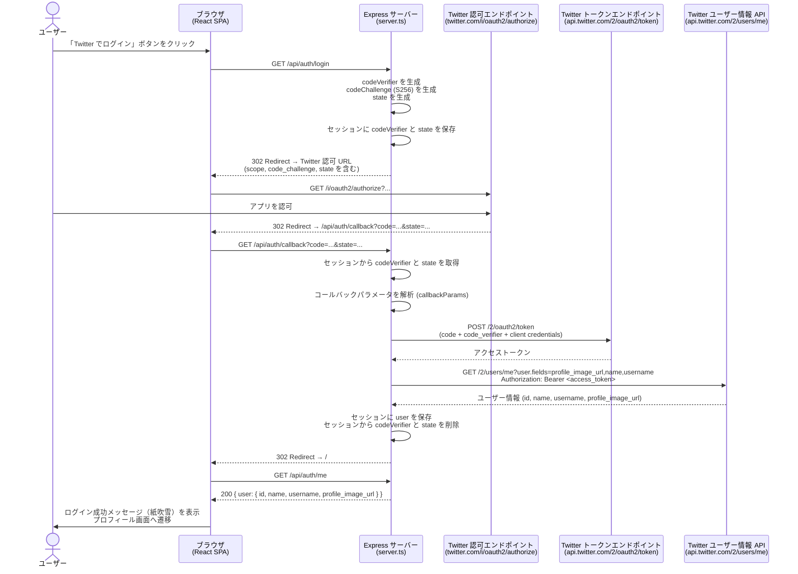
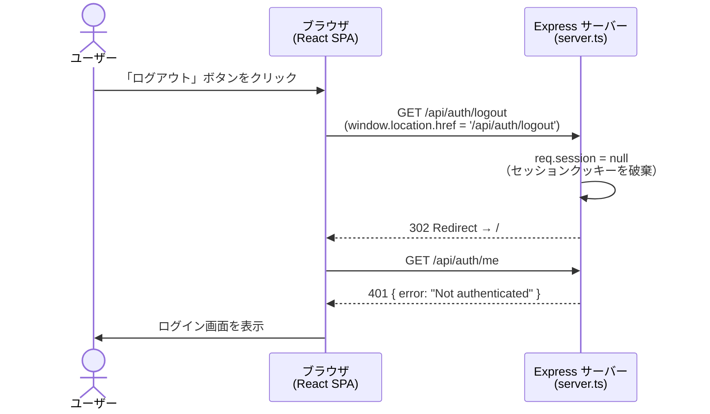
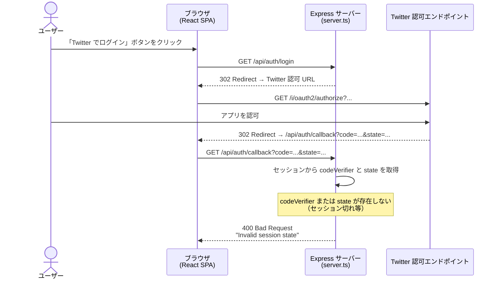
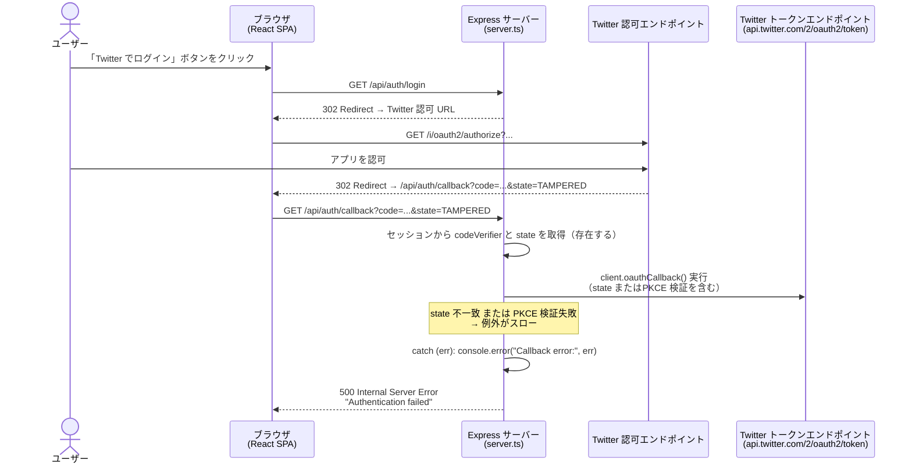
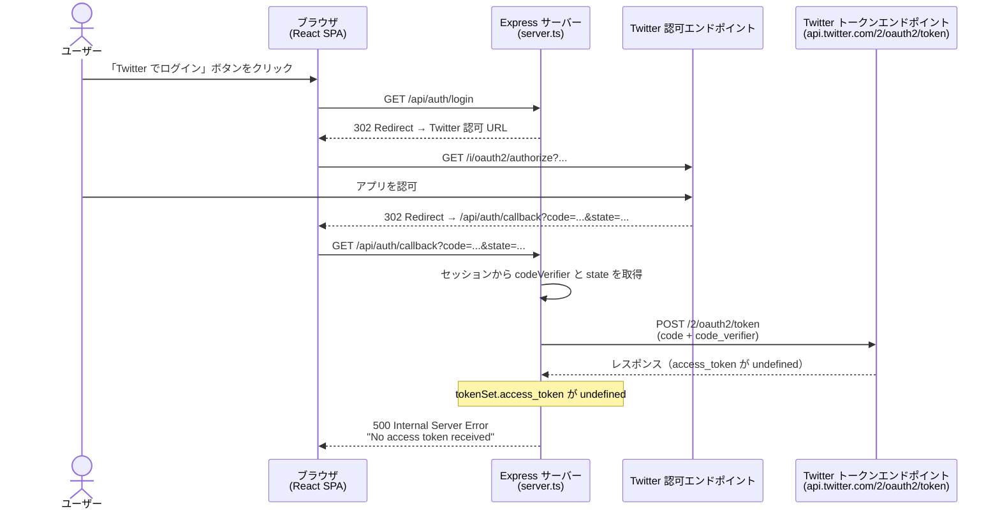
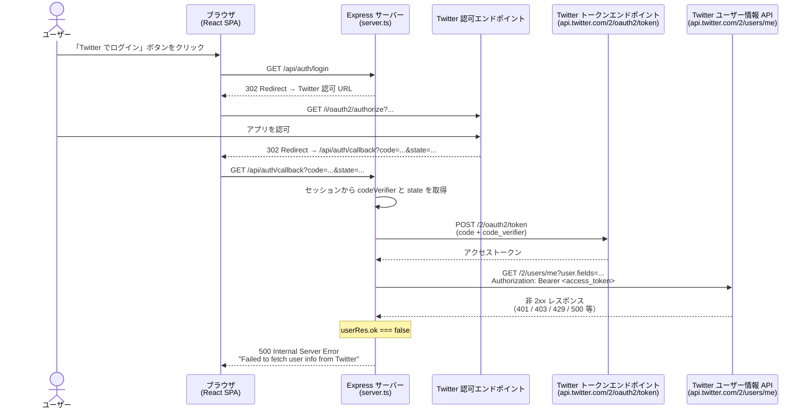

# ログインフロー: 全パターン

Twitter OAuth2/OIDC 認証サンプルの処理フローをまとめたドキュメントです。

## 目次

1. [ログイン開始〜成功](#1-ログイン開始成功)
2. [ログアウト処理](#2-ログアウト処理)
3. [エラーケース](#3-エラーケース)

---

## 1. ログイン開始〜成功

詳細: [login-flow_success.md](./login-flow_success.md)

---

## 2. ログアウト処理

詳細: [login-flow_logout.md](./login-flow_logout.md)

---

## 3. エラーケース

詳細: [login-flow_error.md](./login-flow_error.md)

### エラーケース 1: セッション不正 → 400

### エラーケース 2: state 不一致 / PKCE 検証失敗 → 500

### エラーケース 3: アクセストークン未取得 → 500

### エラーケース 4: ユーザー情報取得失敗 → 500

