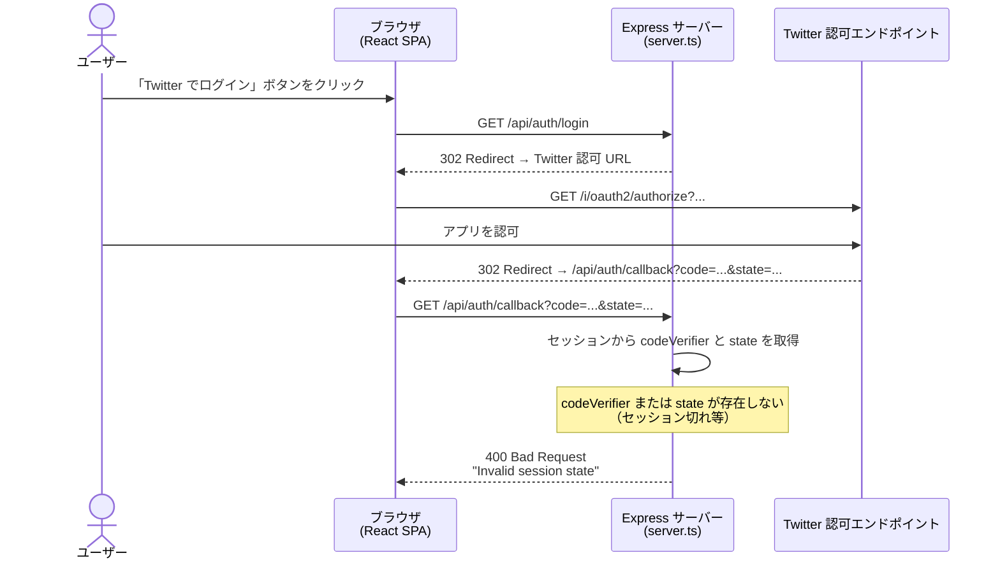
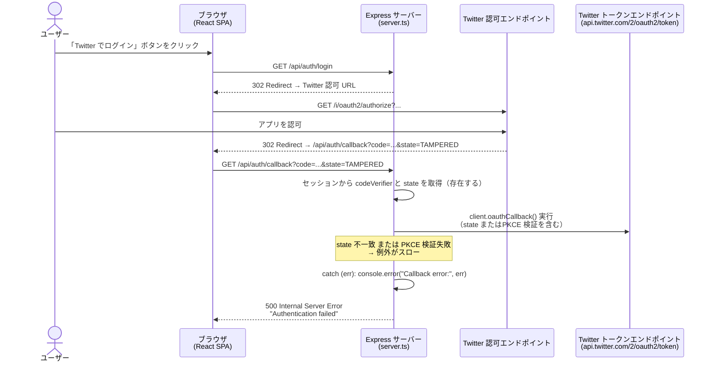
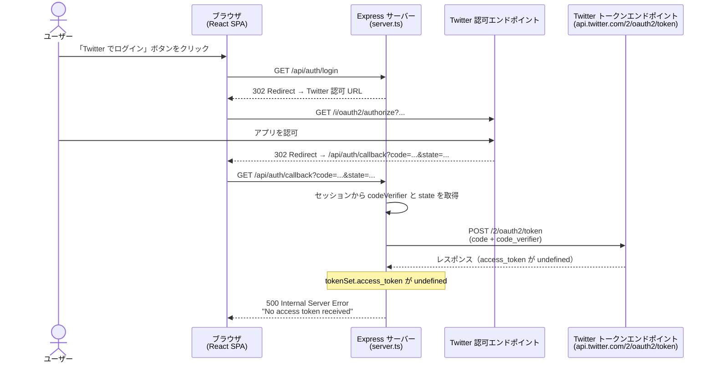
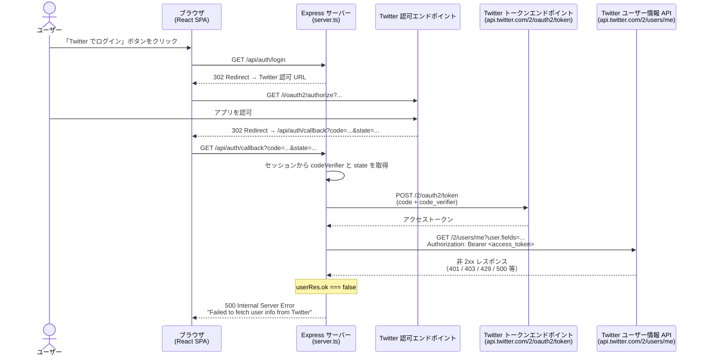

# ログインフロー: エラーケース

## エラーケース一覧

| # | エラー | 発生タイミング | HTTPステータス | レスポンス |
|---|---|---|---|---|
| 1 | セッション不正 | コールバック受信時 | 400 | `Invalid session state` |
| 2 | state 不一致 / PKCE 検証失敗 | `oauthCallback()` 実行時 | 500 | `Authentication failed` |
| 3 | アクセストークン未取得 | トークン交換後 | 500 | `No access token received` |
| 4 | ユーザー情報取得失敗 | Twitter API 呼び出し後 | 500 | `Failed to fetch user info from Twitter` |

---

## エラーケース 1: セッション不正

コールバック受信時にセッションに `codeVerifier` または `state` が存在しない場合。
（セッション切れ・ブラウザのバック操作・不正アクセス等）

---

## エラーケース 2: state 不一致 / PKCE 検証失敗

`oauthCallback()` 内で state の不一致または PKCE (code_verifier) の検証に失敗した場合。
例外がスローされ catch ブロックで捕捉される。

---

## エラーケース 3: アクセストークン未取得

Twitter トークンエンドポイントからのレスポンスに `access_token` が含まれていない場合。

---

## エラーケース 4: ユーザー情報取得失敗

Twitter ユーザー情報 API が非 2xx ステータスを返した場合。

