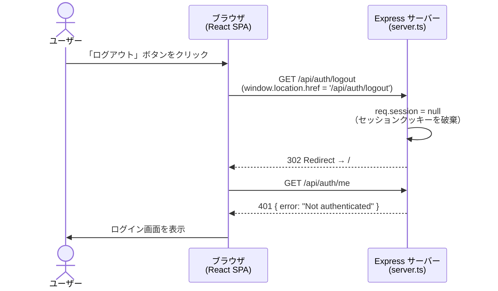

# ログインフロー: ログアウト処理

## 補足

| ステップ | 実装箇所 |
|---|---|
| ログアウトボタン押下 | `handleLogout()` で `sessionStorage.removeItem('login_success_shown')` を実行後 `/api/auth/logout` へ遷移 |
| セッション破棄 | `req.session = null`（cookie-session の仕様: null に設定するとクッキーが削除される） |
| Twitter 側のトークン失効 | **行わない**（Twitter のトークンエンドポイントへの revocation リクエストは送信しない） |
