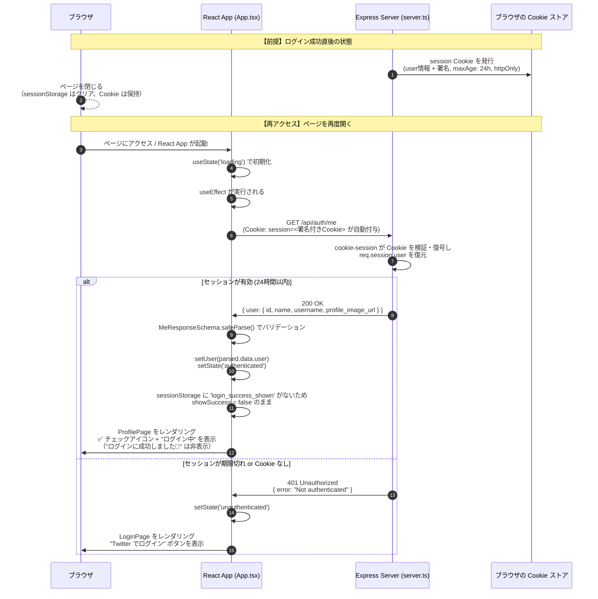

# ログイン成功後〜再アクセス時のセッション復元フロー

## 概要

`cookie-session` ミドルウェアがセッション情報（ユーザー情報）を署名付きCookieとして保存する。
Cookieの有効期限は24時間（`maxAge: 24 * 60 * 60 * 1000`）で、ブラウザを閉じても失効しない。
再アクセス時はブラウザが自動的にCookieを送信し、`/api/auth/me` でセッションを復元する。

---

## シーケンス図

---

## 補足

| 項目 | 値 | 補足 |
|------|-----|------|
| Cookie名 | `session` | `server.ts:69` |
| セッション有効期限 | 24時間 | `server.ts:71` |
| httpOnly | `true` | JSからアクセス不可（XSS対策）`server.ts:72` |
| secure | 本番環境のみ `true` | `server.ts:73` |
| sameSite | `lax` | CSRF対策 `server.ts:74` |
| ログイン成功演出の管理 | `sessionStorage` | ページを閉じるとクリアされる → 再アクセス時は"成功しました🎉"は非表示 `App.tsx:184` |
