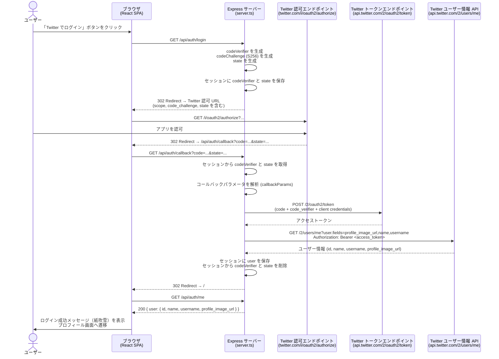

# ログインフロー: ログイン開始〜成功

## 補足

| ステップ | 実装箇所 |
|---|---|
| codeVerifier / codeChallenge / state の生成 | `generators.codeVerifier()`, `generators.codeChallenge()`, `generators.state()` |
| セッション保存 | `req.session.codeVerifier`, `req.session.state` |
| 認可 URL の構築 | `client.authorizationUrl({ scope, code_challenge, code_challenge_method: "S256", state })` |
| トークン交換 | `client.oauthCallback(CALLBACK_URL, params, { code_verifier, state })` |
| ユーザー情報取得 | `fetch("https://api.twitter.com/2/users/me?user.fields=profile_image_url,name,username")` |
| ログイン成功の表示 | `sessionStorage` の `login_success_shown` フラグで初回のみ紙吹雪を表示 |
